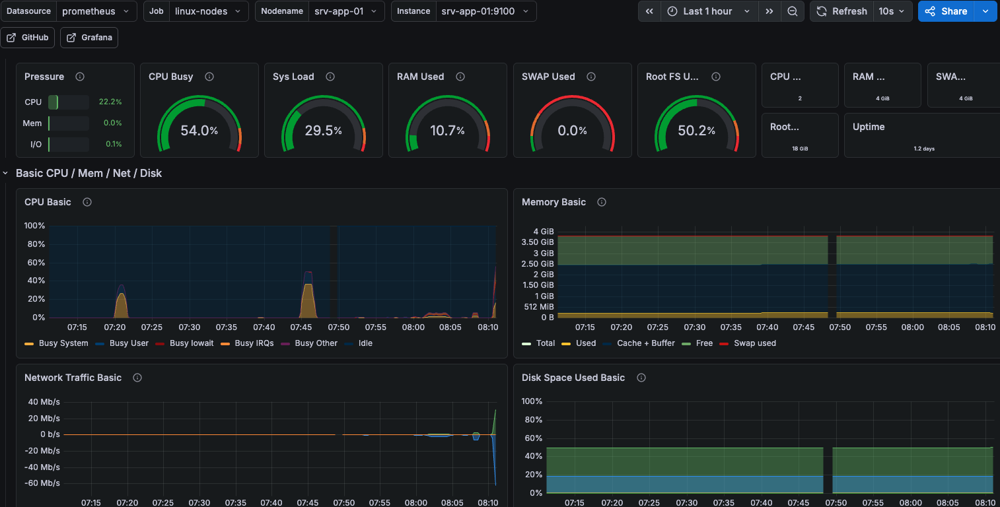
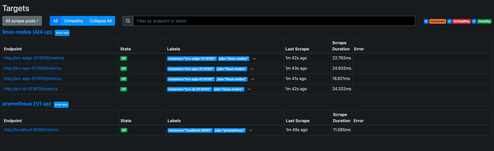
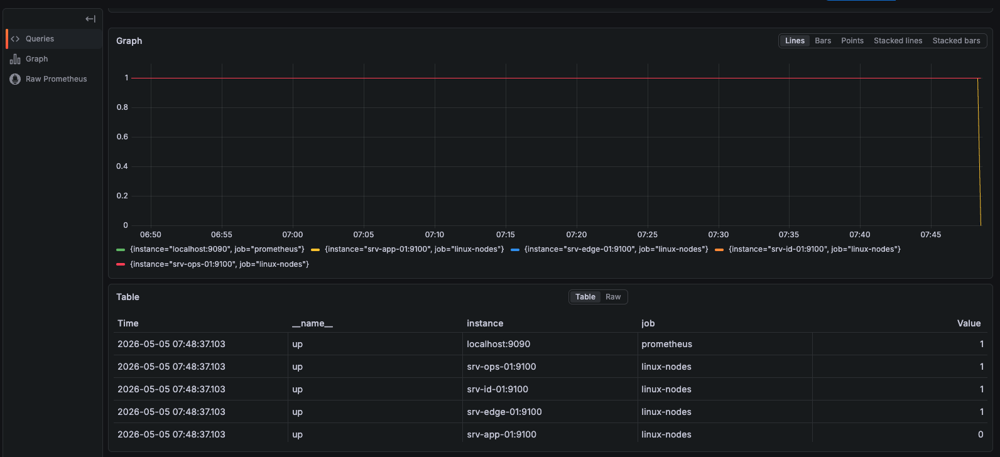
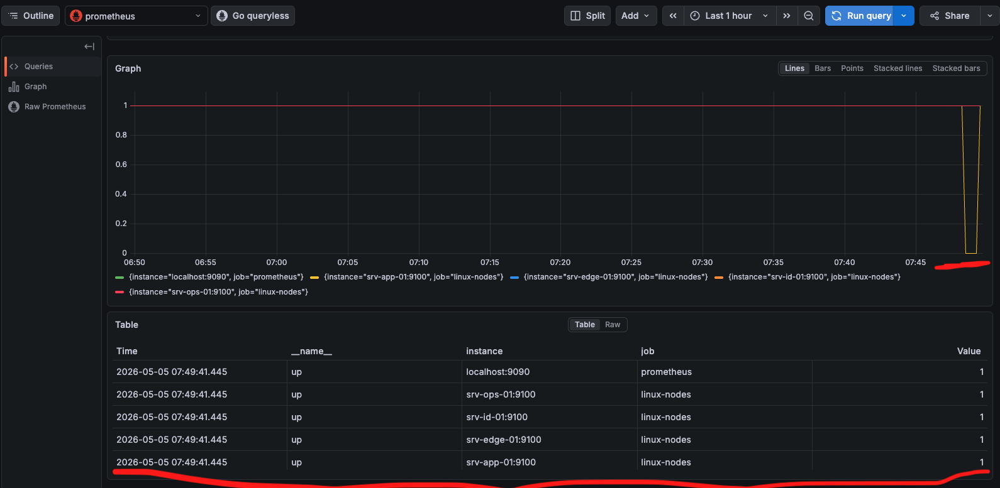

# 19 – Observability with Prometheus and Grafana

## Dashboard Preview

The following screenshot shows Grafana visualizing Node Exporter metrics for `srv-app-01`.

The dashboard displays CPU usage, system load, memory usage, filesystem usage, network traffic, and other system-level metrics collected by Prometheus.



---

## Goal

Add metrics-based observability to the Enterprise Linux Lab using Prometheus, Node Exporter, and Grafana.

This phase complements the existing Nagios monitoring setup.

Nagios answers:

```text
Is the host or service up?
```

Prometheus and Grafana answer:

```text
How is the system behaving over time?
```

This phase enables:

- System metrics collection
- Centralized metrics storage
- Dashboard-based visibility
- CPU, memory, disk, filesystem, and network monitoring
- Operational insight across all current lab servers

---

## Design Context

The lab already includes centralized monitoring with Nagios Core on `srv-ops-01`.

Nagios provides:

- Host reachability checks
- Service checks
- HTTP checks
- SSH checks
- Disk and load threshold checks
- Alerting behavior

However, Nagios is primarily check-based.

This phase adds metrics-based observability.

Prometheus and Grafana do not replace Nagios.

They complement it.

```text
Nagios
  -> health checks
  -> OK / WARNING / CRITICAL

Prometheus + Grafana
  -> metrics and trends
  -> behavior over time
```

This makes the Operations layer more complete.

---

## Architecture Overview

Prometheus and Grafana run on:

```text
srv-ops-01
```

Node Exporter runs on all current lab servers:

```text
srv-id-01
srv-edge-01
srv-ops-01
srv-app-01
```

Architecture:

```text
                 Internet
                    |
             (UTM Shared NAT)
                    |
              srv-edge-01
              Node Exporter
             10.10.10.20
                    |
        ---------------------------------------------------
        |                              |                   |
   srv-id-01                      srv-ops-01           srv-app-01
 Node Exporter              Prometheus + Grafana     Node Exporter
 10.10.10.10                    Node Exporter        10.10.10.40
                                10.10.10.30
```

Prometheus scrape flow:

```text
srv-ops-01:Prometheus  --->  srv-id-01:9100
srv-ops-01:Prometheus  --->  srv-edge-01:9100
srv-ops-01:Prometheus  --->  srv-ops-01:9100
srv-ops-01:Prometheus  --->  srv-app-01:9100
```

Grafana reads from Prometheus:

```text
Grafana  --->  Prometheus  --->  Node Exporter targets
```

---

## Scope

Included:

- Installing Node Exporter on all current servers
- Running Node Exporter as a systemd service
- Installing Prometheus on `srv-ops-01`
- Configuring Prometheus scrape targets
- Running Prometheus as a systemd service
- Installing Grafana on `srv-ops-01`
- Connecting Grafana to Prometheus as a data source
- Importing a Node Exporter dashboard
- Verifying that all targets are UP
- Keeping Grafana access internal-only through SSH tunnel

---

## Ports

| Component | Server | Port | Purpose |
|---|---|---:|---|
| Node Exporter | All servers | `9100` | Host metrics |
| Prometheus | `srv-ops-01` | `9090` | Metrics storage and query UI |
| Grafana | `srv-ops-01` | `3000` | Dashboards |

Access is restricted by firewall and access model.

---

## Node Exporter

Node Exporter exposes Linux system metrics.

Examples:

- CPU
- Memory
- Disk
- Filesystem
- Network
- Load average

It runs on each monitored Linux server and exposes metrics on:

```text
:9100/metrics
```

---

## Node Exporter Installation

Run on each server:

```text
srv-id-01
srv-edge-01
srv-ops-01
srv-app-01
```

The lab runs on ARM64 architecture:

Download and install Node Exporter:

```bash
cd /tmp
wget https://github.com/prometheus/node_exporter/releases/download/v1.8.2/node_exporter-1.8.2.linux-arm64.tar.gz
tar xvf node_exporter-1.8.2.linux-arm64.tar.gz
sudo cp node_exporter-1.8.2.linux-arm64/node_exporter /usr/local/bin/
```

Create a dedicated service account:

```bash
sudo useradd --no-create-home --shell /usr/sbin/nologin node_exporter
sudo chown node_exporter:node_exporter /usr/local/bin/node_exporter
```

Create the systemd service:

```bash
sudo vim /etc/systemd/system/node_exporter.service
```

Content:

```ini
[Unit]
Description=Node Exporter
After=network.target

[Service]
User=node_exporter
Group=node_exporter
Type=simple
ExecStart=/usr/local/bin/node_exporter

[Install]
WantedBy=multi-user.target
```

Enable and start:

```bash
sudo systemctl daemon-reload
sudo systemctl enable --now node_exporter
```

Verify:

```bash
systemctl status node_exporter --no-pager
curl -s http://localhost:9100/metrics | head
```

Expected output includes:

```text
# HELP
# TYPE
```

---

## Node Exporter Firewall Rules

### Internal Servers Using UFW

On internal servers such as:

```text
srv-id-01
srv-app-01
```

allow Prometheus on `srv-ops-01` to scrape metrics:

```bash
sudo ufw allow from 10.10.10.30 to any port 9100 proto tcp
sudo ufw reload
```

Verify:

```bash
sudo ufw status numbered
```

This keeps Node Exporter reachable only from the operations server.

---

### Edge Server Using iptables

On `srv-edge-01`, allow Prometheus from `srv-ops-01`:

```bash
sudo iptables -A INPUT -p tcp -s 10.10.10.30 --dport 9100 -j ACCEPT
sudo netfilter-persistent save
```

Verify:

```bash
sudo iptables -L INPUT -n -v | grep 9100
```

---

## Prometheus

Prometheus runs on `srv-ops-01`.

It pulls metrics from all Node Exporter targets.

Prometheus listens on:

```text
localhost:9090
```

or:

```text
srv-ops-01:9090
```

depending on access path.

In this lab, direct public exposure is avoided.

---

## Prometheus Installation

Run on `srv-ops-01`:

```bash
cd /tmp
wget https://github.com/prometheus/prometheus/releases/download/v2.54.1/prometheus-2.54.1.linux-arm64.tar.gz
tar xvf prometheus-2.54.1.linux-arm64.tar.gz
```

Copy binaries:

```bash
sudo cp prometheus-2.54.1.linux-arm64/prometheus /usr/local/bin/
sudo cp prometheus-2.54.1.linux-arm64/promtool /usr/local/bin/
```

Create user and directories:

```bash
sudo useradd --no-create-home --shell /usr/sbin/nologin prometheus

sudo mkdir -p /etc/prometheus
sudo mkdir -p /var/lib/prometheus
```

Copy console files:

```bash
sudo cp -r prometheus-2.54.1.linux-arm64/consoles /etc/prometheus/
sudo cp -r prometheus-2.54.1.linux-arm64/console_libraries /etc/prometheus/
```

Set ownership:

```bash
sudo chown -R prometheus:prometheus /etc/prometheus /var/lib/prometheus
sudo chown prometheus:prometheus /usr/local/bin/prometheus /usr/local/bin/promtool
```

---

## Prometheus Configuration

Create:

```bash
sudo vim /etc/prometheus/prometheus.yml
```

Content:

```yaml
global:
  scrape_interval: 15s

scrape_configs:
  - job_name: "prometheus"
    static_configs:
      - targets:
          - "localhost:9090"

  - job_name: "linux-nodes"
    static_configs:
      - targets:
          - "srv-id-01:9100"
          - "srv-edge-01:9100"
          - "srv-ops-01:9100"
          - "srv-app-01:9100"
```

Set ownership:

```bash
sudo chown prometheus:prometheus /etc/prometheus/prometheus.yml
```

Validate:

```bash
promtool check config /etc/prometheus/prometheus.yml
```

Expected:

```text
SUCCESS: /etc/prometheus/prometheus.yml is valid prometheus config file syntax
```

---

## Prometheus systemd Service

Create:

```bash
sudo vim /etc/systemd/system/prometheus.service
```

Content:

```ini
[Unit]
Description=Prometheus Monitoring System
After=network.target

[Service]
User=prometheus
Group=prometheus
Type=simple
ExecStart=/usr/local/bin/prometheus \
  --config.file=/etc/prometheus/prometheus.yml \
  --storage.tsdb.path=/var/lib/prometheus \
  --web.console.templates=/etc/prometheus/consoles \
  --web.console.libraries=/etc/prometheus/console_libraries

[Install]
WantedBy=multi-user.target
```

Enable and start:

```bash
sudo systemctl daemon-reload
sudo systemctl enable --now prometheus
```

Verify:

```bash
systemctl status prometheus --no-pager
curl -s http://localhost:9090/-/ready
```

Expected:

```text
Prometheus Server is Ready.
```

Check targets:

```bash
curl -s http://localhost:9090/api/v1/targets | head
```

Expected:

```text
health":"up"
```

for:

```text
srv-id-01:9100
srv-edge-01:9100
srv-ops-01:9100
srv-app-01:9100
```

---

## Access Prometheus UI

Prometheus is not exposed publicly.

Use SSH tunnel from macOS:

```bash
ssh -L 9090:localhost:9090 srv-ops-01
```

Open:

```text
http://localhost:9090
```

Check:

```text
Status → Targets
```

Expected:

```text
All targets are UP.
```

---

## Prometheus Targets View

The following screenshot shows the Prometheus Targets page after configuration.

All configured Node Exporter targets are in the `UP` state, which confirms that Prometheus can successfully scrape metrics from all current lab servers.



---

## Grafana

Grafana runs on `srv-ops-01`.

It connects to Prometheus as a data source and visualizes metrics through dashboards.

Grafana listens on:

```text
:3000
```

In this lab, Grafana is accessed through SSH tunnel instead of opening the port broadly.

---

## Grafana Installation

Run on `srv-ops-01`:

```bash
sudo apt update
sudo apt install -y apt-transport-https software-properties-common wget gpg
```

Create keyring directory:

```bash
sudo mkdir -p /etc/apt/keyrings
```

Install Grafana GPG key:

```bash
wget -q -O - https://apt.grafana.com/gpg.key | sudo gpg --dearmor -o /etc/apt/keyrings/grafana.gpg
```

Add Grafana repository:

```bash
echo "deb [signed-by=/etc/apt/keyrings/grafana.gpg] https://apt.grafana.com stable main" | sudo tee /etc/apt/sources.list.d/grafana.list
```

Install Grafana:

```bash
sudo apt update
sudo apt install -y grafana
```

Enable and start:

```bash
sudo systemctl enable --now grafana-server
```

Verify:

```bash
systemctl status grafana-server --no-pager
curl -I http://localhost:3000
```

Expected:

```text
HTTP/1.1 302 Found
```

or:

```text
HTTP/1.1 200 OK
```

---

## Access Grafana UI

Grafana is not exposed publicly.

Use SSH tunnel from macOS:

```bash
ssh -L 3000:localhost:3000 srv-ops-01
```

Open:

```text
http://localhost:3000
```

Default login:

```text
Username: admin
Password: admin
```

After first login, Grafana requires changing the password.

---

## Configure Prometheus Data Source

In Grafana:

```text
Connections
→ Data sources
→ Add data source
→ Prometheus
```

Set URL:

```text
http://localhost:9090
```

Click:

```text
Save & test
```

Expected:

```text
Data source is working
```

---

## Import Node Exporter Dashboard

In Grafana:

```text
Dashboards
→ New
→ Import
```

Use dashboard ID:

```text
1860
```

Select the Prometheus data source and import.

This provides a ready-made Linux host dashboard with:

- CPU usage
- Memory usage
- Disk usage
- Filesystem usage
- Network traffic
- Load average

---

## Useful PromQL Queries

### Target Health

```promql
up
```

Meaning:

```text
1 = target is reachable
0 = target is down
```

---

### Load Average

```promql
node_load1
```

---

### Available Memory

```promql
node_memory_MemAvailable_bytes
```

In GiB:

```promql
node_memory_MemAvailable_bytes / 1024 / 1024 / 1024
```

---

### Filesystem Free Space

```promql
node_filesystem_avail_bytes
```

For root filesystem:

```promql
node_filesystem_avail_bytes{mountpoint="/"}
```

For backup storage:

```promql
node_filesystem_avail_bytes{mountpoint="/srv/backups"}
```

---

### CPU Usage

```promql
100 - (avg by(instance) (rate(node_cpu_seconds_total{mode="idle"}[5m])) * 100)
```

---

## Validation Test

A simple CPU load test can be used to confirm metrics are visible.

On `srv-app-01`:

```bash
yes > /dev/null &
```

Observe CPU usage in Grafana.

Stop the test:

```bash
pkill yes
```

Expected:

- CPU usage rises on `srv-app-01`
- Dashboard reflects the change
- CPU usage returns to normal after stopping the process

---

## Validation and Failure Detection Test

A simple validation test was performed to confirm that Prometheus detects target failures correctly.

The test used `srv-app-01` as an example target.

### Step 1 – Confirm Normal State

Before the test, all Prometheus targets were healthy.

Query used in Grafana Explore:

```promql
up
```

Expected result:

```text
srv-id-01:9100      = 1
srv-edge-01:9100    = 1
srv-ops-01:9100     = 1
srv-app-01:9100     = 1
localhost:9090      = 1
```

---

### Step 2 – Stop Node Exporter on `srv-app-01`

On `srv-app-01`:

```bash
sudo systemctl stop node_exporter
```

Then the query was executed again:

```promql
up
```

Prometheus correctly reported the target as down:

```text
srv-app-01:9100 = 0
```

This confirms that Prometheus detects exporter unavailability correctly.



---

### Step 3 – Start Node Exporter Again

On `srv-app-01`:

```bash
sudo systemctl start node_exporter
```

The `up` query was executed again.

Prometheus showed the target as healthy again:

```text
srv-app-01:9100 = 1
```

This confirms successful recovery detection.



---


## Access Model

The monitoring tools remain internal-only.

Prometheus UI:

```text
Access through SSH tunnel:
http://localhost:9090
```

Grafana UI:

```text
Access through SSH tunnel:
http://localhost:3000
```

No WAN exposure is introduced.

No broad firewall opening is required.

If VPN-based browser access is desired later, Grafana can be allowed from the edge LAN IP because VPN traffic appears to internal systems as `10.10.10.20`.

Example future rule on `srv-ops-01`:

```bash
sudo ufw allow from 10.10.10.20 to any port 3000 proto tcp
sudo ufw reload
```

This is not required when using SSH tunnels.

---

## Verification Checklist

- Node Exporter runs on `srv-id-01`
- Node Exporter runs on `srv-edge-01`
- Node Exporter runs on `srv-ops-01`
- Node Exporter runs on `srv-app-01`
- Prometheus runs on `srv-ops-01`
- Prometheus config validates successfully
- Prometheus targets are all UP
- Grafana runs on `srv-ops-01`
- Grafana is reachable through SSH tunnel
- Prometheus is configured as Grafana data source
- Node Exporter dashboard is imported
- CPU, memory, disk, filesystem, and network metrics are visible

---

## Operational Notes

- Nagios remains the primary health-check and alerting system at this stage
- Prometheus and Grafana provide metrics and trends
- Grafana is not exposed to the WAN
- Node Exporter access is restricted to Prometheus where firewall policy applies
- Metrics collection helps identify trends before outages occur
- `/srv/backups` can now be observed as part of filesystem monitoring
- Additional exporters can be added later as services grow

---

## Future Improvements

Possible future extensions:

- Alertmanager
- Prometheus alert rules
- Grafana alerts
- Loki for centralized logs
- Blackbox exporter for HTTP endpoint checks
- Nginx exporter
- Dashboard screenshots in the repository
- Monitoring for `srv-app-02` after high availability is added
- Automation with Ansible

---

## Outcome

At the end of this phase:

- `srv-ops-01` runs Prometheus and Grafana
- All current servers expose system metrics through Node Exporter
- Prometheus successfully scrapes all targets
- Grafana visualizes system metrics through dashboards
- The lab now has both health-check monitoring and metrics-based observability

The Operations layer is now stronger because it can answer both:

```text
Is it working?
```

and:

```text
How is it behaving over time?
```

---

## Design Rationale

This phase strengthens the Operations capability of the lab.

Nagios already provides centralized health checks and alerting.

Prometheus and Grafana add time-series metrics and visual analysis.

This separation is intentional:

```text
Nagios = health and alerting
Prometheus = metrics collection and query
Grafana = dashboards and visualization
```

The design keeps operational tools internal-only and does not expose dashboards publicly.

This follows the lab principles:

- Dedicated server roles
- Internal services with restricted exposure
- Security before access
- Operational visibility without public exposure
- Manual implementation before automation
